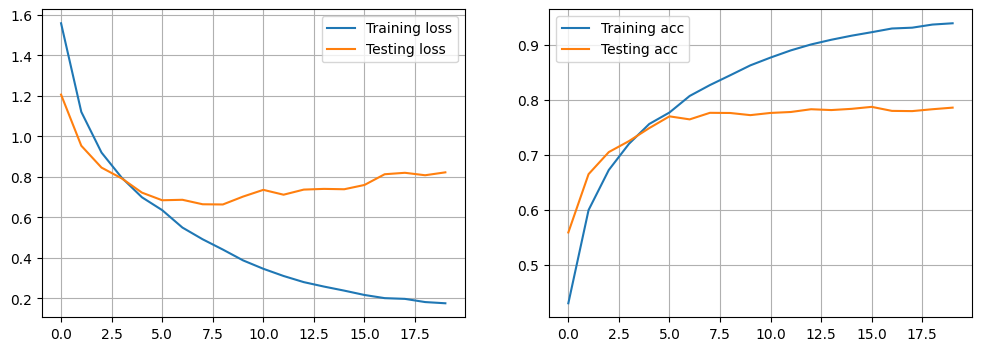
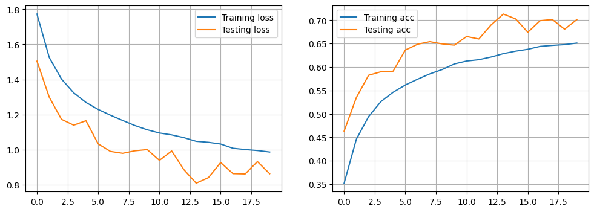

# Practical work 09 - Exercices

- **Students:** Daniel Ribeiro Cabral, Ruben Terceiro

## Exercice 1 - Data Augmentation

**a) Report the accuracy on the train set and on the test set for your different experiments.  Do you observe an improvement using data augmentation ?**

| CNN | Architecture description | Acc. train | Acc. test |
|-----|--------------------------|------------|-----------|
|  No DA - 20 epochs | CONV(32F,same)-RELU-CONV(32F,same)-RELU-MAXP(2)-CONV(32F,same)-RELU-MAXP(2)-DENSE | 0.9386 | 0.78 |
|  With DA v1 - 20epochs | CONV(32F,same)-RELU-CONV(32F,same)-RELU-MAXP(2)-CONV(32F,same)-RELU-MAXP(2)-DENSE | 0.65 | 0.7 |
|  With DA v2 - lower augmentation | same | 0.7587  | 0.7997 |
|  With DA v3 - bigger augmentation | same |  0.5783  |  0.63 |
| NoDa - New Archi VGG | VGG Lookalike | 0.9265 | 0.861 |
| with Da - New Archi VGG | VGG Lookalike | accuracy: 0.8081 | 0.848 |


**b) Compare the evolution of the loss through the training epochs, with and without using data augmentation. Comment your observations.**

Wihout data augmentation : 



We can see that the model learns really well on the training set, almost too well, which is why its performance on the test set stops getting better after a while. This is a classic case of memorizing rather than learning to generalize. The testing loss decreases, and around epoch 5, it starts to plateau and even slightly increases, indicating the beginnings of overfitting as the model improves on the training data but not on the unseen testing data.



Training is tougher because the model sees new, slightly altered images all the time, which helps it learn to generalize better with the data augmentation. The test performance is a bit up and down, but it doesn't have the same problem as before—it doesn't stop improving as early. We can see the 2 curves come very close that is a good sign for our model.

- Without data augmentation, the model can almost predict the training images perfectly, but it struggles to do as well on new images it hasn't seen before.
- With data augmentation, the model doesn't get as good on the training images, but it gets better at handling new, unseen images.

Overall, using data augmentation seems like a good idea because it helps the model perform more consistently on new images.

**c) If you tried with different data augmentation strategies, which one seems to give the best results ?**

For this analysis, I experimented with three distinct data augmentation strategies. The first strategy adheres to the specifications given in the notebook. The second strategy involves a smaller augmentation, while the third employs a more bigger augmentation by adjusting the parameters accordingly. Below is the code utilized for these experiments:

**Base DA :** 
```
train_datagen = ImageDataGenerator(
    rotation_range=20,
    width_shift_range=0.2,
    height_shift_range=0.2,
    shear_range=0.2,
    zoom_range=0.2,
    horizontal_flip=True,
    fill_mode='nearest'
)
```


**Smaller Augmentation of Base DA :** 
```
train_datagen_mild = ImageDataGenerator(
    rotation_range=10,  # less rotation
    width_shift_range=0.1,  # less translation in width
    height_shift_range=0.1,  # less translation in height
    shear_range=0.1,  # less shear
    zoom_range=0.1,  # less zoom
    horizontal_flip=True,  # same flipping
    fill_mode='nearest'
)
```


**Bigger Augmentation of Base DA :** 
```
train_datagen_intense = ImageDataGenerator(
    rotation_range=40,  # more rotation
    width_shift_range=0.3,  # more translation in width
    height_shift_range=0.3,  # more translation in height
    shear_range=0.3,  # more shear
    zoom_range=0.3,  # more zoom
    horizontal_flip=True,  # same flipping
    fill_mode='nearest'
)
```


Has said before, data augmentation generally improves the generalization of the model on unseen data (test set), as indicated by the test accuracies when comparing the model with no data augmentation (No DA - 20 epochs) to those with data augmentation. The test accuracy improves when data augmentation is used, even though the training accuracy might decrease. This suggests that data augmentation helps prevent overfitting.

Here are some obseervations done with the results on the results of each strategy :

- **With DA v1 - Base Augmentation** : Using the base data augmentation settings resulted in a decrease in training accuracy to 65% but an improvement in test accuracy to 70%. This suggests better generalization compared to no augmentation though there's still a notable gap.

- **With DA v2 - Lower Augmentation** : This setup shows a training accuracy of 75.87% and the highest test accuracy among all the tests done (79.97%). This indicates a good balance between learning and generalizing, makinf it the best of all.

- **With DA v3 - Bigger Augmentation** : The more bigger augmentation resulted in the lowest training accuracy (57.83%) and a lower test accuracy (63%) compared to the lower augmentation version. This demonstrates that too much augmentation might lead to underfitting, where the model fails to learn significant patterns from the training data.


Data augmentation is really helpful because it makes models perform better on new, unseen data. The best method we found uses a moderate amount of augmentation (called DA v2), which helps the model learn well without changing the data too much. This approach prevents the model from fitting too closely to the training data (which can cause problems when it sees new data) or from not learning enough from the data. It's important to find the right amount of data changes to help the model perform at its best.

## Exercise 2 - Visualisation of Activations

if needed

## Exercise 3 - Review questions - Optional

**a) Explain 2 strategies to visualise the modelling taking place in CNNs.**

**b) What do we try to fight when using data augmentation ?**

**c) What are the implementation strategies for data augmentation ?**

