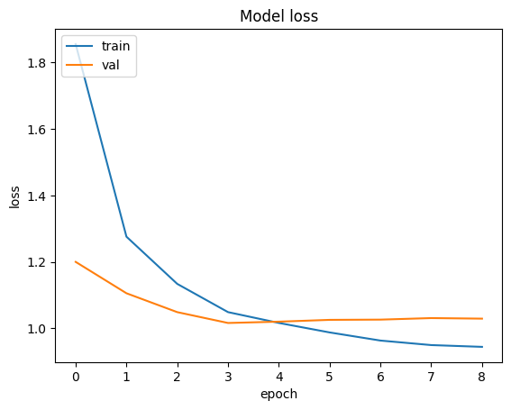
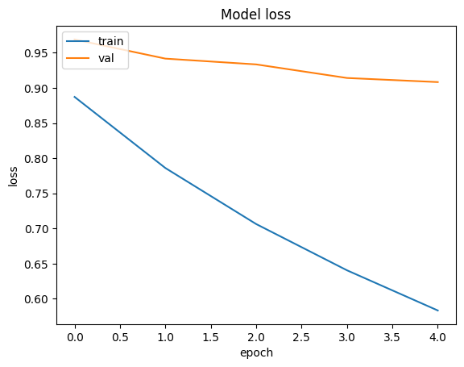
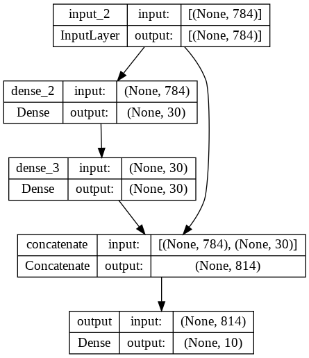

# Practical work 10 - Exercices

- **Students:** Daniel Ribeiro Cabral, Ruben Terceiro

# Results 

## Exercice 1 - Functional API of Keras

| Model                   | Architecture                                                    | Callback| Total parameters | Acc. train % | Acc. test % |
|-------------------------|-----------------------------------------------------------------|---------|--------------|-------------|-------------|
| 1                       | Sequential - Structure inspired by VGGNet                       | yes    |479,434       | 0.83 | 0.86        |
| 2                       | Functional API - Single Path inspired by VGGNet (SPVGGNet)      | yes    |479,434       | 0.83 | 0.82        |
| 3                       | Functional API - Multiple Path inspired by VGGNet (MPVGGNet)    | yes    |583,690       | 0.84 | 0.82        |
| 4                       | Functional API - Mutliple Path Personalised Architecture (MPPA) | yes    |50,477,450    | 0.1  | 0.1         |

**a) Re-use one of your best CNN architecture from the previous PWs and transform the
model definition from sequential to the functional API. Observe that you get the same
number of parameters and similar performances between the sequential and functional
models.**
In the table above, we can see that the model 2 has the same number of parameters as the model 1. Regarding the accuracy, the model 1 has a better accuracy on the test set than the model 2, but the diffrence it's ridiculous.

**b) Experiment with non-sequential strategies such as multiple features or multiple paths as
described in the lecture slides.**
Done, results written in the table.

**d) Use callbacks to save the best trained models according to a monitoring of the accuracy on the test set.**
Callbacks used for all the experiments.

**Conclusion according to our results.**
The first two models have a similar performance (first one slightly better in accuracy test), the third also has similar performance but with more parameters. According to these similar results, we can say that using functional API didn't improve the performance of the models.
Finally, the last one was imagined by us so the performance are really bad, the purpose of this model was above to test functional API with 3 different paths.

## Exo 2 - Transfer learning

| Model Name     | Description           | Train Accuracy | Validation Accuracy | val_loss   |
|----------------|-----------------------|----------------|---------------------|--------|
| Mobile Net - 1       | Only head of network trained         | 0.7055           | 0.685                | 1.0294    |
| Mobile Net - 2        | Fine-tune the whole model | 0.8175 | 0.9084 | 0.7267 |

For this first image we have the line chart of the loss of the model, only trained on the head : 

And here we have the all model fine tuned :

## Exo 3 - Optional : Review Questions

### Why (or when) do we need the functional API of Keras?
The functional API in Keras is useful when you want to build more complex models that the simple layer-by-layer style of the sequential API can't handle. We might need it when:

- **We have multiple types of data inputs or outputs** : Like if your model needs to take both pictures and text to make a decision.
- **Our model isn't just a straight line** : Sometimes we might want parts of our model to branch off or join back together, or even use a piece of the model multiple times. Like in this example : 

Basically, it's good for when you need to do something more complicated than just stacking layers in order like with the sequential way.

### What are the benefits of using transfer learning?

Transfer learning is highly effective as it allows models to leverage knowledge acquired from almost the same tasks. This approach offers significant advantages:

- **Time efficiency**: There is no need to build a model from the ground up. Instead, an existing model pre-trained on a related task can be adapted, allowing it to quickly learn new features specific to the current task.
- **Reduced data requirements**: A pre-trained model requires less data to achieve effective learning on a new task because it already possesses a lot of knowledge.
- **Enhanced performance**: TL typically results in improved model performance, especially in scenarios where data is scarce for the new task.

So Transfer learning provides a "head start," making the modeling process quicker, simpler, and often more successful by doing our specific task.