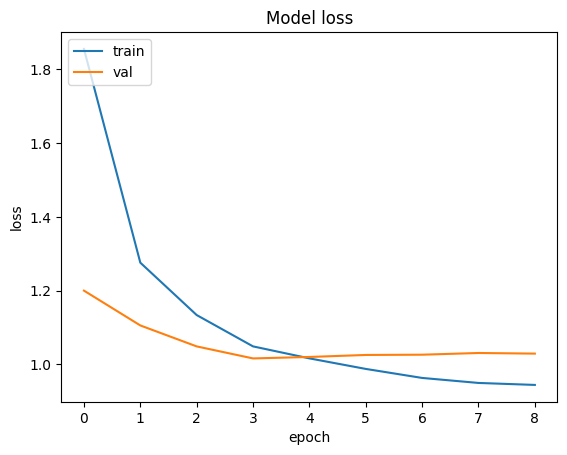
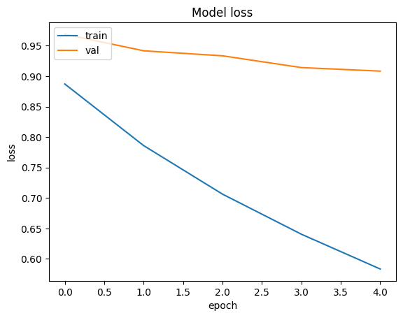

# Results 

## Exo 2 - Transfer learning

| Model Name     | Description           | Train Accuracy | Validation Accuracy | val_loss   |
|----------------|-----------------------|----------------|---------------------|--------|
| Mobile Net - 1       | Only head of network trained         | 0.7055           | 0.685                | 1.0294    |
| Mobile Net - 2        | Fine-tune the whole model | 0.8175 | 0.9084 | 0.7267 |

For this first image we have the line chart of the loss of the model, only trained on the head : 

And here we have the all model fine tuned :

## Exo 3 - Optional : Review Questions

### Why (or when) do we need the functional API of Keras?
The functional API in Keras is useful when you want to build more complex models that the simple layer-by-layer style of the sequential API can't handle. We might need it when:

- **We have multiple types of data inputs or outputs** : Like if your model needs to take both pictures and text to make a decision.
- **Our model isn't just a straight line** : Sometimes we might want parts of our model to branch off or join back together, or even use a piece of the model multiple times. Like in this example : 

Basically, it's good for when you need to do something more complicated than just stacking layers in order like with the sequential way.

### What are the benefits of using transfer learning?

Transfer learning is highly effective as it allows models to leverage knowledge acquired from almost the same tasks. This approach offers significant advantages:

- **Time efficiency**: There is no need to build a model from the ground up. Instead, an existing model pre-trained on a related task can be adapted, allowing it to quickly learn new features specific to the current task.
- **Reduced data requirements**: A pre-trained model requires less data to achieve effective learning on a new task because it already possesses a lot of knowledge.
- **Enhanced performance**: TL typically results in improved model performance, especially in scenarios where data is scarce for the new task.

So Transfer learning provides a "head start," making the modeling process quicker, simpler, and often more successful by doing our specific task.